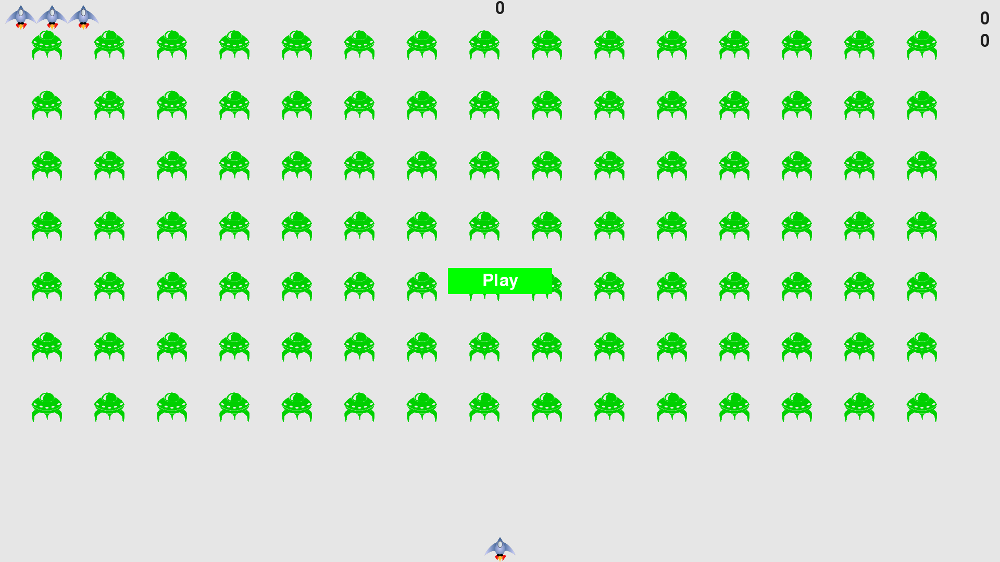

# alien_invasion_python_crash_course
This is the Alien Invasion game project from Python Crash Course 2nd Edition

## Starting the game
To start the game, navigate to the folder in a terminal and run the following commands
```
python3 -m pip install --user pygame
python3 alien_invasion.py
```

## Gameplay
- To start the game, click on the play button.
- Use the left and right arrow keys to move.
- Use the spacebar to shoot.
- Press "Q" to quit.

## Screenshot


### Happy Hunting!